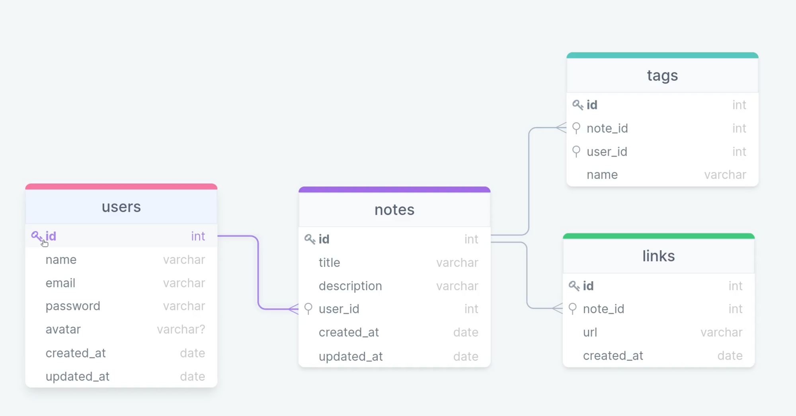

<h1>RocketNotes Backend</h1>

Este é o repositório do Backend da aplicação RocketNotes, uma API completa criada utilizando Node.js e Express, com um banco de dados SQLite, manipulado através do Query Builder Knex.js e ferramenta Beekeper Studio.

<h2>Estrutura do Banco de Dados</h2>

O banco de dados da aplicação possui quatro tabelas: users, notes, tags e links. A tabela usuários contém informações de login dos usuários, como nome, e-mail e senha. A tabela notas contém informações sobre as notas criadas pelos usuários, como título, conteúdo e data de criação. A tabela etiquetas contém informações sobre as etiquetas criadas pelos usuários e a tabela notas_etiquetas contém a relação entre as notas e as etiquetas.

<h2>Como Usar</h2>

Para utilizar a aplicação, basta executar os seguintes comandos:

<pre><code>npm i
npm run migrate
npm run dev
</code></pre>

O servidor estará disponível em <a href="http://localhost:3000">http://localhost:3000</a>.

<h2>Ferramentas Utilizadas</h2>

A aplicação utiliza as seguintes ferramentas:

<ul>
  <li><strong>Node.js e Express:</strong> plataforma e framework utilizados para a construção do servidor da aplicação.</li>
  <li><strong>SQLite e Knex.js:</strong> banco de dados e Query Builder utilizados para a manipulação do banco de dados da aplicação.</li>
  <li><strong>Autenticação e JWT:</strong> autenticação de usuários implementada através de tokens JWT (JSON Web Token).</li>
  <li><strong>Middlewares:</strong> funções utilizadas para manipular as requisições e respostas do servidor.</li>
  <li><strong>Upload de imagens:</strong> implementado upload de imagens para as notas criadas pelos usuários.</li>
  <li><strong>API Restful:</strong> a API segue os princípios de uma API RESTful.</li>
  <li><strong>Cors:</strong> módulo utilizado para habilitar o CORS (Cross-Origin Resource Sharing).</li>
  <li><strong>PM2:</strong> gerenciador de processos utilizado para manter o servidor da aplicação em execução.</li>
  <li><strong>Deploy e utilização do render:</strong> aplicação hospedada em algum servidor que possua renderização.</li>
  <li><strong>Variáveis de ambiente:</strong> variáveis de ambiente utilizadas para armazenar informações sensíveis, como chaves secretas de autenticação.</li>
  <li><strong>Testes automatizados e Jest:</strong> implementado testes automatizados utilizando o framework Jest.</li>
</ul>

Este projeto serve como um bom exemplo de como criar uma aplicação backend utilizando Node.js e Express, manipulando um banco de dados utilizando SQLite e Knex.js e implementando funcionalidades de autenticação e upload de imagens.

